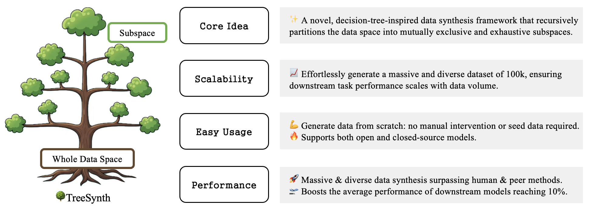
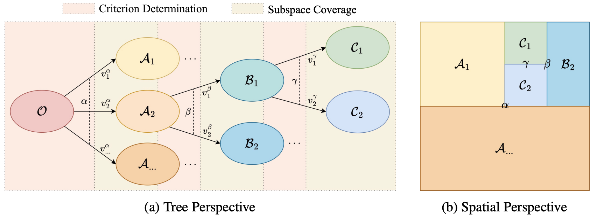
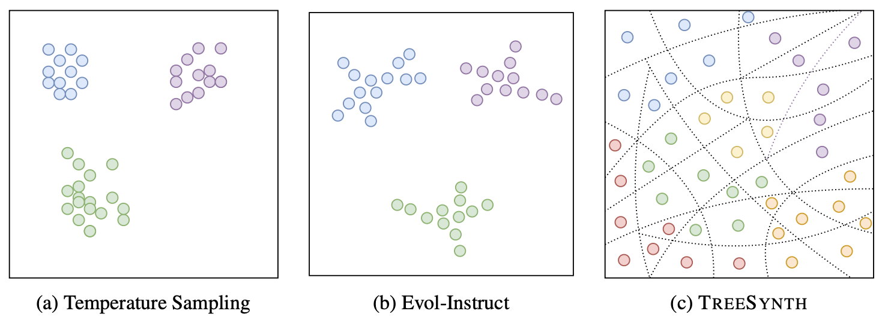
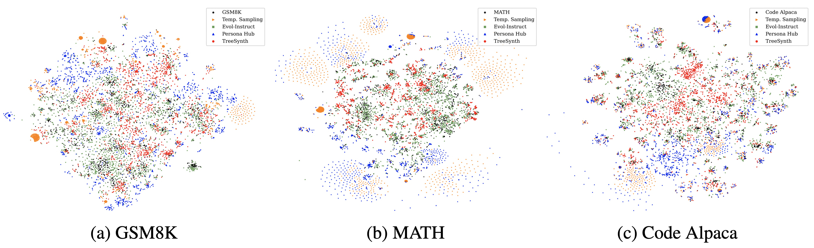
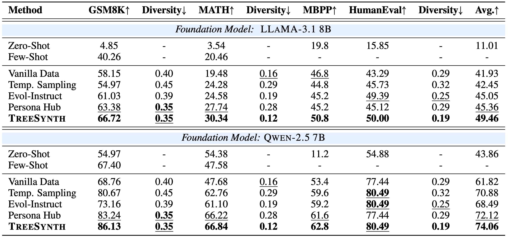
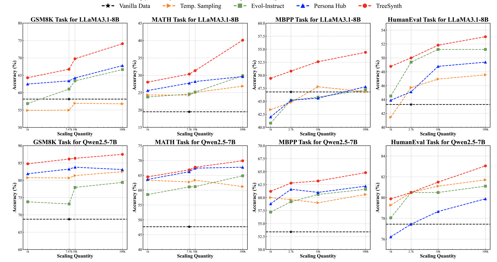
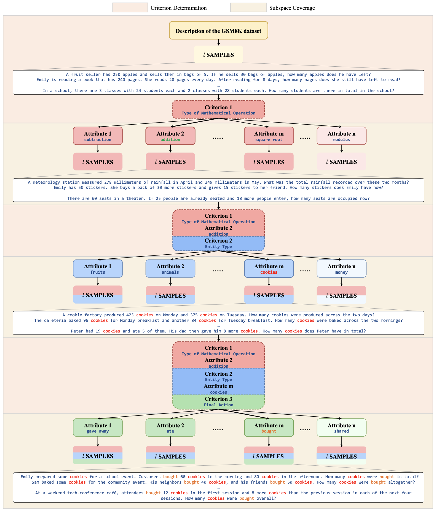

# 🌳 [TreeSynth: Synthesizing Diverse Data from Scratch via Tree-Guided Subspace Partitioning](https://arxiv.org/pdf/2503.17195)

<div align="center">
  <a href="https://arxiv.org/pdf/2503.17195"></a>
  <!-- <a href="https://huggingface.co/datasets/proj-persona/PersonaHub"></a> -->
  <a href="https://creativecommons.org/licenses/by-nc-sa/4.0/"></a>
  <a href="https://opensource.org/licenses/MIT"></a>
</div>

<div align="center">

</div>

## 🚀 News

- **[5/16/2025]** 🚀 We're excited to announce the release of our new paper and the initial public availability of its corresponding code.


## 💡 Introduction
We introduce **TREESYNTH**, a tree-guided subspace-based data synthesis approach inspired by decision trees. It constructs a spatial partitioning tree to recursively divide a task-specific full data space (i.e., root node) into numerous atomic subspaces (i.e., leaf nodes) with mutually exclusive and exhaustive attributes to ensure both distinctiveness and comprehensiveness before synthesizing samples within each atomic subspace.
<div align="center">

</div>
This globally dividing-and-synthesizing method finally collects subspace samples into a comprehensive dataset, effectively circumventing repetition and space collapse to ensure the diversity of large-scale data synthesis. 
<div align="center">

</div>


## 📊 Performance
### 🌈 Excellent Data Diversity
TreeSynth exhibits substantially better data diversity and more comprehensive coverage across various tasks and models than both human-curated datasets and peer synthetic methods.
<div align="center">

</div>
<small><em> t-SNE visualization of LLaMA3.3-70B-Instruct-synthesized datasets for various methods across GSM8K, MATH, and Code Alpaca styles.</em></small>

### 🏆 Superior Downstream Performance
Models trained on TreeSynth data consistently outperform those trained on both human-crafted datasets and synthetic baselines across all the tasks, foundation and generation models
<div align="center">

</div>
<small><em>Model performance and data diversity comparison of various methods with GPT-4o-powered data synthesis.</em></small>

### 📈 Scalable Data Synthesis with Quality Preservation
With the global data spatial perspective guided by tree structure, TreeSynth effectively scales datasets while preserving data quality, suggesting great scalability wherein downstream performance consistently improves with increased data volume.
<div align="center">

</div>
<small><em>Model performance trends across data scales for different methods powered by GPT-4o.</em></small>


## ⚡ Quick Start

### 🛠️ Prerequisites

- Python 3.8+
<!-- - Required dependencies (see `requirements.txt`) -->
- API access to OpenAI/Azure or local model deployment via vLLM

### 📥 Installation

```bash
git clone https://github.com/cpa2001/TreeSynth.git
cd TreeSynth
```

### ⚙️ Configuration

#### 1️⃣ Backend Setup

TreeSynth supports three backend configurations. Edit `config.py` to configure your preferred backend:

**Option A: OpenAI API**
```python
BACKEND_CONFIGS = {
    "openai": {
        "api_key": "your-openai-api-key",
        "model_name": "gpt-4o",
    }
}
```

**Option B: Azure OpenAI**
```python
BACKEND_CONFIGS = {
    "azure": {
        "api_key": "your-azure-api-key",
        "model_name": "gpt-4o",
        "azure_endpoint": "https://your-endpoint.openai.azure.com/",
        "api_version": "2024-10-21",
    }
}
```

**Option C: vLLM (Local Deployment)**
```python
BACKEND_CONFIGS = {
    "vllm": {
        "api_base": "http://localhost:8000/v1",
        "api_key": "your-vllm-api-key",
        "model_name": "/path/to/model/qwen2_5-72b-instruct",
    }
}
```

For vLLM deployment, use the provided script:
```bash
bash vllm.sh
```

#### 2️⃣ Tree Generation Parameters

Configure the core TreeSynth parameters in `DEFAULT_CONFIG`:

```python
DEFAULT_CONFIG = {
    "max_depth": 4,                          # Maximum tree depth
    "num_samples_per_node": 10,              # Samples generated per node
    "max_attribute_count": 50,               # Maximum attributes per node
    "max_sample_infinite_attribute": 50,     # Threshold for infinite attributes
    "infinite_path_samples": 10,             # Samples for infinite paths
    "max_workers": 64,                       # Concurrent workers
    "max_concurrent_requests": 64,           # Concurrent API requests
    "max_retries": 5,                        # Maximum retry attempts
}
```

#### 3️⃣ API Pool Configuration (Optional)

For high-throughput synthesis, configure multiple API endpoints:

```python
# Multiple Azure endpoints for load balancing
OPENAI_API_POOL = [
    {
        "endpoint": "https://endpoint1.openai.azure.com/",
        "key": "azure-api-key1",
        "version": "2024-10-21",
        "model": "gpt-4o",
    },
    {
        "endpoint": "https://endpoint2.openai.azure.com/",
        "key": "azure-api-key2",
        "version": "2024-10-21",
        "model": "gpt-4o",
    }
]
```

### ▶️ Running TreeSynth

Execute the data generation pipeline:

```bash
# Generate tree structure and synthesize data
python main.py --backend openai --task_type math
```

### ▶️ Example Usage

```python
from treesynth import TreeSynth

# Initialize TreeSynth with configuration
synthesizer = TreeSynth(
    backend="openai",           # or "azure", "vllm"
    max_depth=4,
    num_samples_per_node=10,
    task_type="math"
)

# Generate diverse dataset
dataset = synthesizer.generate_dataset()
print(f"Generated {len(dataset)} diverse samples")
```

### 🧩 Advanced Configuration

For custom task domains, modify the task-specific prompts and templates:

```python
# Custom task configuration
CUSTOM_TASK_CONFIG = {
    "task_name": "custom_domain",
    "root_description": "Your domain description",
    "attribute_types": ["type1", "type2", "type3"],
    "sample_template": "Your sample generation template"
}
```


## 🗺️ Overview of TreeSynth
TreeSynth consists of two key stages: data space partitioning and subspace data synthesis.

During the former phase, TreeSynth employs a spatial partitioning tree to recursively divide a task-specific whole data space (i.e., root node defined by textual descriptions) into numerous atomic subspaces (i.e., leaf nodes). These subspaces are characterized by mutually exclusive and exhaustive attribute values to ensure both distinctiveness and diversity.

In the subsequent subspace data synthesis phase, samples are generated within each subspace separately, before collecting them as a diverse and comprehensive dataset. By employing this globally divide-and-synthesize methodology, TreeSynth effectively prevents repetition and space collapse to ensure the diversity and completeness of large-scale data synthesis, successfully avoiding the drawbacks of previous methods.
<div align="center">

</div>
<small><em>A spatial partitioning tree visualization of TreeSynth, exemplified through GSM8K-style data synthesis.</em></small>

## 📚 Citation
If you found our work useful, please consider starring and citing. Thank you!
```latex
@article{wang2025treesynth,
  title={TreeSynth: Synthesizing Diverse Data from Scratch via Tree-Guided Subspace Partitioning},
  author={Wang, Sheng and Chen, Pengan and Zhou, Jingqi and Li, Qintong and Dong, Jingwei and Gao, Jiahui and Xue, Boyang and Jiang, Jiyue and Kong, Lingpeng and Wu, Chuan},
  journal={arXiv preprint arXiv:2503.17195},
  year={2025}
}
```

[//]: # ()
[//]: # (## Star History)

[//]: # ()
[//]: # ([TreeSynth]&#40;https://github.com/cpa2001/TreeSynth&#41; 当前 star 数为 0，暂无增长趋势。)

